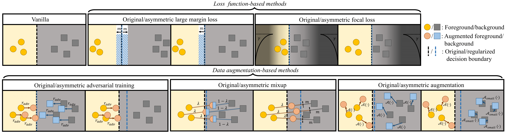

# Introduction 

We find neural network is prone to overfit the foreground samples because of class imbalance, especially in medical image segmentation. Empirically, we find that when training with limited data and strong class imbalance, at test time the distribution of logit activations may shift across the decision boundary, while samples of the well-represented class seem unaffected.

In our study, we explore some asymmetric techiniques which are explicitly designed to counter logit shift of the under-represented classes. We find these techiques can improve segmentation by regularizing the logit distribution. 

The methods are summarized here:

<br/> <div align=center></div>

We implemented our proposed techiques with DeepMedic (Tensorflow) and a 3D U-Net (Pytorch), please find details in either subfolders. 


## Acknowledgement
This code based on the standardized baselines provided by [DeepMedic](https://github.com/deepmedic/deepmedic) and [nnUNet](https://github.com/MIC-DKFZ/nnUNet). 

## Note
- We test the fundamental functions of the code, but there maybe some issues taking considering that there are quite a few functions. Please let me know if you figure out something unexpected, thanks (zeju.li18@imperial.ac.uk).
- Both DeepMedic and nnUNet are updated to a newer version by their authors. Integration with the newest version is feasible and maybe will be done in the future if it is needed.

## Citation
If you find our work has positively influenced your projects, please kindly consider citing our work:

```
@article{li2020analyzing,
  title={Analyzing Overfitting under Class Imbalance in Neural Networks for Image Segmentation},
  author={Li, Zeju and Kamnitsas, Konstantinos and Glocker, Ben},
  journal={IEEE Transactions on Medical Imaging},
  year={2020},
  publisher={IEEE}
}
```

and

```
@inproceedings{li2019overfitting,
  title={Overfitting of neural nets under class imbalance: Analysis and improvements for segmentation},
  author={Li, Zeju and Kamnitsas, Konstantinos and Glocker, Ben},
  booktitle={International Conference on Medical Image Computing and Computer-Assisted Intervention},
  pages={402--410},
  year={2019},
  organization={Springer}
}
```
